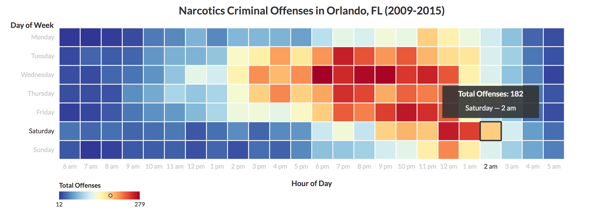

# d3-summary-tiles

Summary tiles are a way of visualizing summarized, rectangular data. They are good for creating things like [correlation matrices](https://bl.ocks.org/madams1/63dd30728bbb486394097bf9a647574b), [topographic grids](https://bl.ocks.org/madams1/1613db1ba5d0c315b93e8543924c415c), and [temporal heatmaps](https://bl.ocks.org/madams1/db4b7376ac0e6bb57daf1c09499f3bc0).



Source: [City of Orlando Open Data](https://data.cityoforlando.net/Orlando-Police/OPD-Crimes-Data-Lens/cmgh-vsxe) - Orlando Police Department records management system.

```javascript
// dummy usage example
let summaryTiles = d3.summaryTiles();

summaryTiles
    .x("x")
    .y("y")
    .fill("fill")
    .tileWidth(40)
    .tileHeight(35);

d3.select("body")
    .datum(data)
    .call(summaryTiles);
```

## Installing

If you use NPM, `npm install d3-summary-tiles`. Otherwise, download the [latest release](https://github.com/madams1/d3-summary-tiles/releases/latest).

## API Reference

<a href="#d3-summary-tiles" name="d3-summary-tiles">#</a> <b>d3.summaryTiles</b>()

Constructs a new Summary Tiles generator with the default settings.

```javascript
<script src="https://unpkg.com/d3-summary-tiles/build/d3-summary-tiles.min.js"></script>
<script>

let summaryTiles = d3.summaryTiles();

</script>
```

<a href="#summaryTiles" name="summaryTiles">#</a> <b>summaryTiles</b>(*_selection*)

*_selection* is a d3 selection with data attached to it. (e.g. `d3.select("body").datum(data)`). *Note*: The selection itself depends on [d3-selection](https://github.com/d3/d3-selection), so you'll need to include that separately. If you installed `d3-summary-tiles` with NPM, `d3-selection` is an included dependency.

<a href="#x" name="x">#</a> *summaryTiles*.**x**([*x*])

No default value. If *x* is specified, sets the string used to access the (categorical) property from the data that should be displayed horizontally. If *x* is not specified (and has already been specified), returns the currently set string that corresponds to the data's x property.

<a href="#y" name="y">#</a> *summaryTiles*.**y**([*y*])

No default value. If *y* is specified, sets the string used to access the (categorical) property from the data that should be displayed vertically. If *y* is not specified (and has already been specified), returns the currently set string that corresponds to the data's y property.

<a href="#fill" name="fill">#</a> *summaryTiles*.**fill**([*fill*])

No default value. If *fill* is specified, sets the string used to access the (numeric) property from the data that should be used to color the tiles. If *fill* is not specified (and has already been specified), returns the currently set string that corresponds to the data's fill property.

<a href="#tileWidth" name="tileWidth">#</a> *summaryTiles*.**tileWidth**([*tileWidth*])

No default value. If *tileWidth* is specified, sets the width of each individual tile in pixels. If *tileWidth* is not specified (and has already been specified), returns the currently set tile width in pixels.

<a href="#tileHeight" name="tileHeight">#</a> *summaryTiles*.**tileHeight**([*tileHeight*])

No default value. If *tileHeight* is specified, sets the height of each individual tile in pixels. If *tileHeight* is not specified (and has already been specified), returns the currently set tile height in pixels.

<a href="#fillDomain" name="fillDomain">#</a> *summaryTiles*.**fillDomain**([*fillDomain*])

Default is `d3.extent(data, d => d[summaryTiles.fill()])`. Useful if your data doesn't include the entire range of possible values and you want the color scale to extend to specific minimum and maximum values. If *fillDomain* is specified, sets the `[min, max]` array to *fillDomain*. If *fillDomain* is not specified, returns the currently set array `[min, max]`.

<a href="#title" name="title">#</a> *summaryTiles*.**title**([*title*])

Default is `""`. If *title* is specified, sets the chart title to the given string. If *title* is not specified, returns the currently set title.

<a href="#titleSize" name="titleSize">#</a> *summaryTiles*.**titleSize**([*titleSize*])

Default is `20`. If *titleSize* is specified, sets the font size used for the chart title. If *titleSize* is not specified, returns the currently set title font size.

<a href="#tickLabelSize" name="tickLabelSize">#</a> *summaryTiles*.**tickLabelSize**([*tickLabelSize*])

Default is `12`. If *tickLabelSize* is specified, sets the font size used for the x and y axis tick labels. If *tickLabelSize* is not specified, returns the currently set tick label font size.

<a href="#marginLeft" name="marginLeft">#</a> *summaryTiles*.**marginLeft**([*marginLeft*])

Default is `200`. If *marginLeft* is specified, sets the size in pixels of the left-hand-side margin. The space is used for labeling the y-axis and the y tick labels. If *marginLeft* is not specified, returns the currently set margin size.

<a href="#xLabel" name="xLabel">#</a> *summaryTiles*.**xLabel**([*xLabel*])

Default is `summaryTiles.x()`. If *xLabel* is specified, sets the x-axis label to the given string. If *xLabel* is not specified, returns the currently set label.

<a href="#yLabel" name="yLabel">#</a> *summaryTiles*.**yLabel**([*yLabel*])

Default is `summaryTiles.y()`. If *yLabel* is specified, sets the y-axis label to the given string. If *yLabel* is not specified, returns the currently set label.

<a href="#rotateXTicks" name="rotateXTicks">#</a> *summaryTiles*.**rotateXTicks**()

Rotates the x tick labels 90 degrees. Used with no arguments.

<a href="#flipYAxis" name="flipYAxis">#</a> *summaryTiles*.**flipYAxis**()

Reverses the orientation of the y axis. Used with no arguments.

<a href="#legendTitle" name="legendTitle">#</a> *summaryTiles*.**legendTitle**([*legendTitle*])

Default is `summaryTiles.fill()`. If *legendTitle* is specified, sets the legend title to the given string. If *legendTitle* is not specified, returns the currently set legend title.

<a href="#noLegend" name="noLegend">#</a> *summaryTiles*.**noLegend**()

Don't use a legend. Used with no arguments.

<a href="#noLegendIndicator" name="noLegendIndicator">#</a> *summaryTiles*.**noLegendIndicator**()

Don't show an indicator in the legend when mousing over tiles. Used with no arguments.

<a href="#verticalLegend" name="verticalLegend">#</a> *summaryTiles*.**verticalLegend**()

Creates a vertically-oriented legend beside the chart. Used with no arguments.

<a href="#noXTicks" name="noXTicks">#</a> *summaryTiles*.**noXTicks**()

Don't use x tick labels. Used with no arguments.

<a href="#noYTicks" name="noYTicks">#</a> *summaryTiles*.**noYTicks**()

Don't use y tick labels. Used with no arguments.

<a href="#colorScheme" name="colorScheme">#</a> *summaryTiles*.**colorScheme**([*colorScheme*])

Default is `"YlOrBr"`. If *colorScheme* is specified (and valid), sets the color scheme used to fill tiles. If *colorScheme* is not specified, returns the currently set color scheme name.

The list of valid *colorScheme* names:
- `"BrBG"`
- `"PRGn"`
- `"PiYG"`
- `"PuOr"`
- `"RdBu"`
- `"RdGy"`
- `"RdYlBu"`
- `"RdYlGn"`
- `"Spectral"`
- `"BuGn"`
- `"BuPu"`
- `"GnBu"`
- `"OrRd"`
- `"PuBuGn"`
- `"PuBu"`
- `"PuRd"`
- `"RdPu"`
- `"YlGnBu"`
- `"YlGn"`
- `"YlOrBr"`
- `"YlOrRd"`
- `"Blues"`
- `"Greens"`
- `"Greys"`
- `"Purples"`
- `"Reds"`
- `"Oranges"`
- `"Viridis"`
- `"Inferno"`
- `"Magma"`
- `"Plasma"`

<a href="#reverseColorScale" name="reverseColorScale">#</a> *summaryTiles*.**reverseColorScale**()

Reverse the direction of the color scale. Used with no arguments.

<a href="#strokeColor" name="strokeColor">#</a> *summaryTiles*.**strokeColor**([*strokeColor*])

Default is `"#ffffff"`. If *strokeColor* is specified, sets the color used for each tile's stroke. If *strokeColor* is not specified, returns the currently set tile stroke color.

<a href="#fontColor" name="fontColor">#</a> *summaryTiles*.**fontColor**([*fontColor*])

Default is `"#333333"`. If *fontColor* is specified, sets the color used for all titles and labels. If *fontColor* is not specified, returns the currently set font color.

<a href="#highlightColor" name="highlightColor">#</a> *summaryTiles*.**highlightColor**([*highlightColor*])

Default is `"#333333"`. If *highlightColor* is specified, sets the stroke color for the currently moused over tile. If *highlightColor* is not specified, returns the currently set color.

<a href="#unselectedColor" name="unselectedColor">#</a> *summaryTiles*.**unselectedColor**([*unselectedColor*])

Default is `"#cccccc"`. If *unselectedColor* is specified, sets the color used for tick labels that do not correspond to the currently moused over tile. If *unselectedColor* is not specified, returns the currently set color.

<a href="#nullColor" name="nullColor">#</a> *summaryTiles*.**nullColor**([*nullColor*])

Default is `"#bdbdbd"`. If *nullColor* is specified, sets the color used to fill tiles that have `null` values. If *nullColor* is not specified, returns the currently set color.

<a href="#onClick" name="onClick">#</a> *summaryTiles*.**onClick**([*onClick*])

No default value. If *onClick* is specified, sets the function used to handle click events on individual tiles. If *onClick* is not specified, returns the currently set function.

<a href="#noTooltip" name="noTooltip">#</a> *summaryTiles*.**noTooltip**()

Don't show tooltips when mousing over tiles. Used with no arguments.

<a href="#tooltipWidth" name="tooltipWidth">#</a> *summaryTiles*.**tooltipWidth**([*tooltipWidth*])

Default is `180`. If *tooltipWidth* is specified, sets the width of the tooltip shown when mousing over tiles. If *tooltipWidth* is not specified, returns the currently set width.

<a href="#wrapTooltip" name="wrapTooltip">#</a> *summaryTiles*.**wrapTooltip**()

Creates new lines in the tooltip for each of the pairwise x-y values and the text used to separate them. Used with no arguments.

<a href="#noNullTooltips" name="noNullTooltips">#</a> *summaryTiles*.**noNullTooltips**()

Don't show tooltips when mousing over tiles that have null values. Used with no arguments.

<a href="#pairwiseJoinText" name="pairwiseJoinText">#</a> *summaryTiles*.**pairwiseJoinText**([*pairwiseJoinText*])

Default is `" \u2014 "` (emdash). If *pairwiseJoinText* is specified, sets the text used to separate x-y labels in tooltips. If *pairwiseJoinText* is not specified, returns the currently set text.

<a href="#numberFormat" name="numberFormat">#</a> *summaryTiles*.**numberFormat**([*numberFormat*])

Default is `","`. If *numberFormat* is specified, sets the way numbers should be formatted when displaying them. See [d3-format](https://github.com/d3/d3-format/blob/master/README.md#locale_format) for details and available formats. If *numberFormat* is not specified, returns the currently set formatting string.
